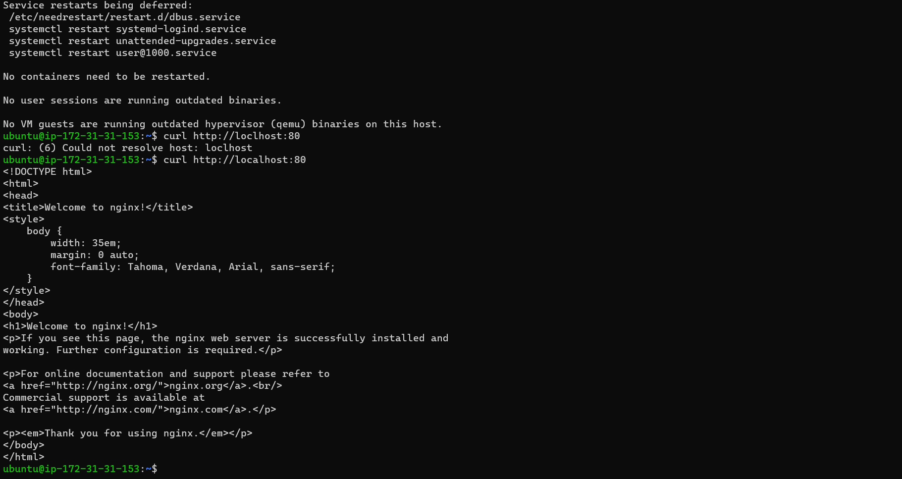

# LEMP STACK IMPLEMENTATION

## STEP 1-INSTALLING THE NGINX WEB SERVER

'sudo apt update'

'sudo apt install nginx'

'curl http://localhost:80' > To confirm our server is running locally and can be accessed from the internet

## STEP-2 INSTALLING MY SQL

'sudo apt install mysql-server'

'sudo mysql_secure_installation' >screen shot below shows the updgrade that was done after installation

'sudo mysql'

## STEP-3 INSTALL PHP

'sudo apt install php-fpm php-mysql'

## STEP-4 CONFIGURING NGINX TO USE PHP PROCESSOR

### CREATE ROOT DIRECTORY FOR OUR DOMAIN
'sudo mkdir /var/www/projectLEMP'

'sudo chown -R $USER:$44797 /var/www/projectLEMP' >TO ASSIGN OWNERSHIP OF DIRECTORY

### OPEN NEW CONFIGURATION FILE OF NGINX IN NANO
'sudo nano /etc/nginx/sites-available/projectLEMP'

### Activate your configuration by linking to the config file from Nginx’s sites-enabled directory:
'sudo ln -s /etc/nginx/sites-available/projectLEMP /etc/nginx/sites-enabled/'

### Test your configuration for syntax errors by typing
'sudo nginx -t'

## STEP 5 – TESTING PHP WITH NGINX
'<?php
phpinfo();'
>no image as I did not get this far with Project-1

Removing files
sudo rm /var/www/your_domain/info.php

## STEP-6 – RETRIEVING DATA FROM MYSQL DATABASE WITH PHP (CONTINUED)

>This will be redone when I clear the bug in my system

 